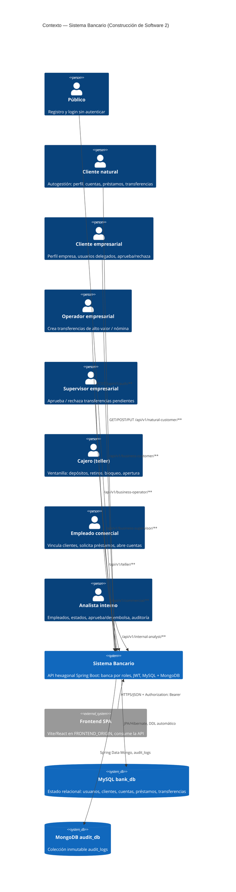

# C4 Nivel 1 — Contexto

## Propósito

Delimitar qué es el sistema, quién lo usa y con qué sistemas externos se
relaciona. Todo el comportamiento bancario vive dentro del sistema; fuera
solo hay actores humanos (vía frontend), bases de datos y el navegador.

## Diagrama

## Actores y endpoints (resumen)

| Actor | Prefijo | Autenticación | Operaciones |
|---|---|---|---|
| Público | `/api/v1/auth` | No (login/registro) + logout con JWT | `POST /login`, `POST /logout`, `POST /register/natural-customer`, `POST /register/business-customer`, `POST /register/user` |
| Cliente natural | `/api/v1/natural-customer` | `ROLE_NATURAL_CUSTOMER` | Perfil (GET/PUT), cuentas, balance, productos, préstamos (solicitar, consultar, pagar), transferencias, operaciones |
| Cliente empresarial | `/api/v1/business-customer` | `ROLE_BUSINESS_CUSTOMER` | Perfil, productos, cuentas, préstamos, `POST /users` (delega operador/supervisor), aprueba/rechaza transferencias propias |
| Operador | `/api/v1/business-operator` | `ROLE_BUSINESS_OPERATOR` | Cuentas, `POST /transfers` (202, umbral), `POST /transfers/{id}/submit`, operaciones |
| Supervisor | `/api/v1/business-supervisor` | `ROLE_BUSINESS_SUPERVISOR` | `GET /transfers/pending`, aprueba/rechaza, operaciones |
| Cajero | `/api/v1/teller` | `ROLE_TELLER_EMPLOYEE` | Cliente por identificación, cuentas (abrir, consultar, balance), depósitos, retiros, bloquear/desbloquear/cerrar |
| Comercial | `/api/v1/commercial` | `ROLE_COMMERCIAL_EMPLOYEE` | Clientes (consultar, actualizar PUT, productos), préstamos (solicitar, estado), abrir cuentas |
| Analista | `/api/v1/internal-analyst` | `ROLE_INTERNAL_ANALYST` | `POST /users/employee`, estado de clientes, aprobar/rechazar/desembolsar/cerrar (DELETE) préstamos, `GET /audit-logs`, operaciones, estado de usuarios |

Detalle método por método: `11-endpoints-flujos.md`.
