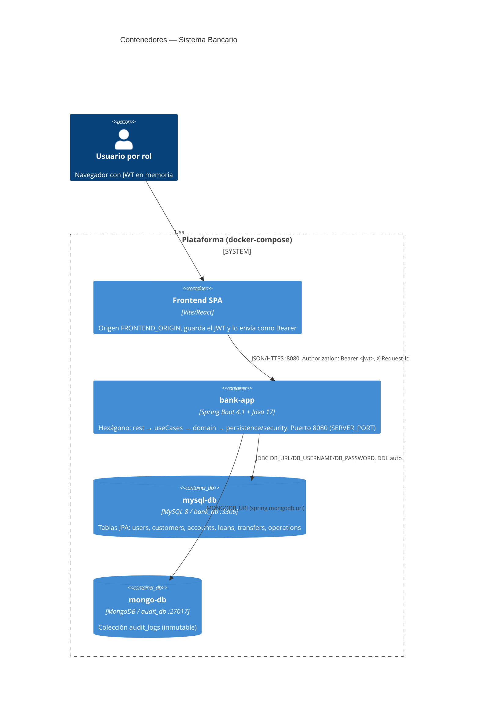
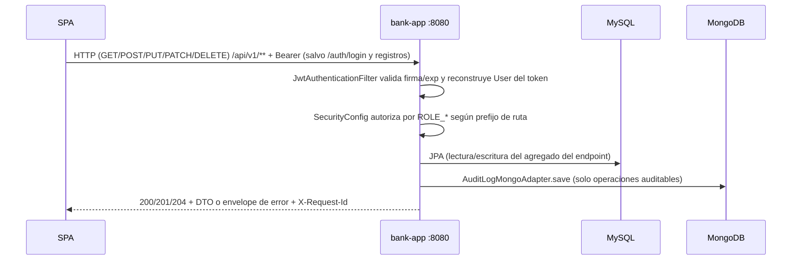

# C4 Nivel 2 — Contenedores

## Propósito

Mostrar dónde se ejecuta cada parte y cómo viaja una petición de endpoint
desde el navegador hasta la base de datos.

## Diagrama

## Contenedores y configuración

| Contenedor | Imagen / arranque | Env relevantes | Papel en los endpoints |
|---|---|---|---|
| `spa` | Fuera de este repo (Vite, `:5173`) | `FRONTEND_ORIGIN` del lado app | Dispara todos los flujos; preflight `OPTIONS` sin JWT |
| `bank-app` | `bank/Dockerfile` (JDK 17 + Maven) | `DB_URL`, `DB_USERNAME`, `DB_PASSWORD`, `MONGODB_URI`, `JWT_SECRET`, `JWT_EXPIRATION_MS`, `FRONTEND_ORIGIN`, `SERVER_PORT` | Atiende `POST/GET/PUT/PATCH/DELETE /api/v1/**`, valida JWT, ejecuta dominio, persiste |
| `mysql-db` | MySQL 8 | `bank_db` | Lecturas/escrituras de todos los endpoints salvo auditoría |
| `mongo-db` | MongoDB | `audit_db.audit_logs` | Solo `GET /api/v1/internal-analyst/audit-logs` (lectura) y escrituras internas de auditoría |

## Flujo de red por endpoint (todos los grupos)

Semántica verificada: `200/201/204` éxito · `400` validación ·
`401` credenciales inválidas · `403` sin token / token obsoleto / rol
incorrecto · `404` con envelope.
