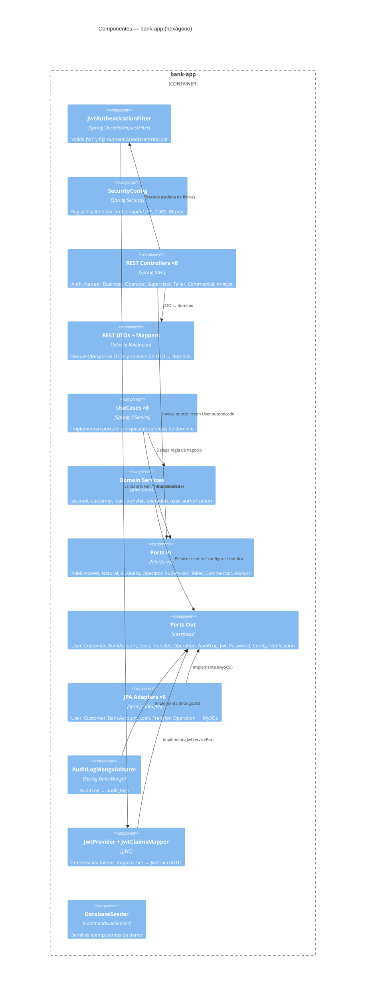
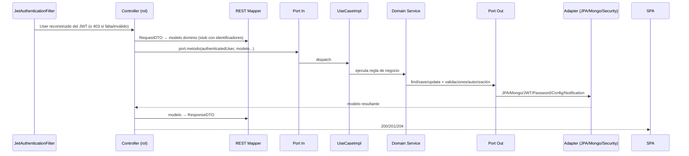

# C4 Nivel 3 — Componentes

## Propósito

Abrir `bank-app` y mostrar los componentes que toca **cada endpoint**:
controladores REST, casos de uso, servicios de dominio, puertos y
adaptadores de salida.

## Diagrama

## Ciclo de vida de una petición (vale para los ~50 endpoints)

Si el servicio lanza excepción de dominio, `GlobalExceptionHandler`
la traduce a envelope (`400/401/403/404/409`); si falla Bean Validation,
`400` antes de tocar el dominio. Detalle por capa: `05`, `06`, `07`, `08`,
`09`, `10`. Detalle por endpoint: `11-endpoints-flujos.md`.
