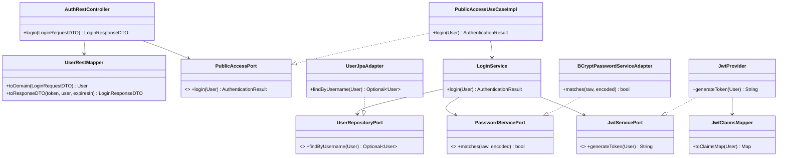

# C4 Nivel 4 — Código

## Propósito

Mostrar las clases que colaboran dentro de un flujo de endpoint, para que un
desarrollador pueda navegar del controller al registro en base de datos sin
perderse.

## Clases por componente (rutas reales)

- REST: `adapters/rest/controllers/*RestController`, `adapters/rest/dtos/requests/*`,
  `adapters/rest/dtos/responses/*`, `adapters/rest/mappers/*`,
  `adapters/rest/exception/GlobalExceptionHandler`
- Casos de uso: `adapters/useCases/*UseCaseImpl` → `domain/ports/in/*Port`
- Dominio: `domain/models/*`, `domain/valueobjects/*`, `domain/enums/*`,
  `domain/services/{account,customer,loan,transfer,operation,user,authorization}/*`,
  `domain/ports/out/*`, `domain/exceptions/*`
- Persistencia JPA: `adapters/persistence/jpa/*JpaAdapter`,
  `.../jpa/entities/*JpaEntity`, `.../jpa/mappers/*JpaMapper`,
  `.../jpa/repositories/SpringDataJpa*Repository`
- Auditoría Mongo: `adapters/persistence/mongodb/AuditLogMongoAdapter`,
  `.../mongodb/documents/AuditLogDocument`, `.../mongodb/mappers/AuditLogMongoMapper`,
  `.../mongodb/repositories/AuditLogMongoRepository`
- Seguridad: `adapters/security/{JwtProvider,JwtAuthenticationFilter,SecurityConfig,BCryptPasswordServiceAdapter,BankUserDetailsAdapter}`,
  `adapters/security/dtos/{JwtClaimsDTO,AuthenticatedUserPrincipal}`,
  `adapters/security/mappers/JwtClaimsMapper`,
  `domain/services/user/LoadAuthenticatedUserService`
- Infraestructura: `infrastructure/seed/DatabaseSeeder`

## Diagrama (flujo `POST /login` como ejemplo canónico)

El mismo esqueleto se repite en todos los endpoints cambiando el trío
`Controller → Port In → Servicio`: ver `11-endpoints-flujos.md` para la
matriz completa.
