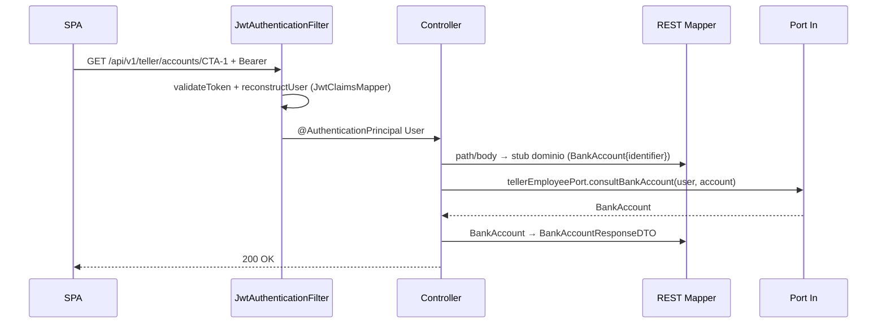
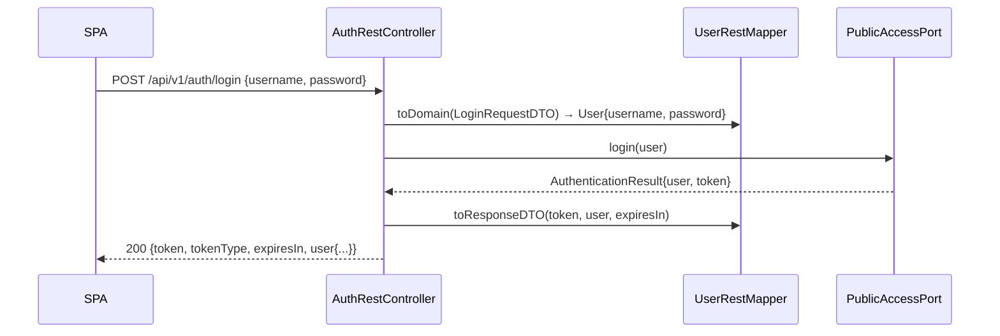

# Capa — Adapters REST (entrada HTTP)

Paquete: `application/adapters/rest/`. Única puerta de entrada HTTP.
No contiene reglas de negocio: valida transporte, mapea DTOs y delega al
puerto `in` con el `User` autenticado.

## Controllers (8) y prefijos

| Controller | `@RequestMapping` | Puerto `in` |
|---|---|---|
| `AuthRestController` | `/api/v1/auth` | `PublicAccessPort` |
| `NaturalCustomerRestController` | `/api/v1/natural-customer` | `NaturalCustomerPort` |
| `BusinessCustomerRestController` | `/api/v1/business-customer` | `BusinessCustomerPort` |
| `BusinessOperatorRestController` | `/api/v1/business-operator` | `BusinessOperatorPort` |
| `BusinessSupervisorRestController` | `/api/v1/business-supervisor` | `BusinessSupervisorPort` |
| `TellerEmployeeRestController` | `/api/v1/teller` | `TellerEmployeePort` |
| `CommercialEmployeeRestController` | `/api/v1/commercial` | `CommercialEmployeePort` |
| `InternalAnalystRestController` | `/api/v1/internal-analyst` | `InternalAnalystPort` |

Patrón de firma: `@AuthenticationPrincipal(expression = "user") User authenticatedUser`
(el `User` de dominio viaja dentro del `AuthenticatedUserPrincipal` que fija
el filtro). Excepciones: `AuthRestController.registerCustomerUser` e
`InternalAnalystRestController` construyen el stub de dominio a mano;
`TellerEmployeeRestController` define su `BankAccountRequestDTO` como clase
interna; `NaturalCustomerRestController` acepta alias singulares
(`/loan`, `/loans/{id}`, `/loan/{id}/payments`).

## DTOs y mappers

- `dtos/requests/`: `Login`, `RegisterNaturalCustomer`, `RegisterBusinessCustomer`,
  `RegisterUser`, `RegisterCompanyUser`, `RegisterEmployeeUser`,
  `UpdateCustomerProfile`, `ChangeCustomerStatus`, `Deposit`, `Withdrawal`,
  `BlockAccount`, `RequestLoan`, `CommercialRequestLoan`, `ApproveLoan`,
  `LoanPayment`, `CreateTransfer`, `RejectTransfer` (+ `BankAccountRequestDTO` interna del teller).
- `dtos/responses/`: `Login`, `User`, `Customer`, `BusinessCustomer`,
  `CustomerProducts`, `BankAccount`, `AccountBalance`, `Loan`, `LoanPayment`,
  `Transfer`, `Operation`, `AuditLog`, `AuditLogPage`.
- `mappers/`: `UserRestMapper`, `CustomerRestMapper`, `CustomerProductsRestMapper`,
  `BankAccountRestMapper`, `LoanRestMapper`, `TransferRestMapper`,
  `OperationRestMapper`, `AuditLogRestMapper` (DTO ↔ dominio, nunca entidades JPA).
- `exception/GlobalExceptionHandler`: envelope + `X-Request-Id` y mapeo
  `400/401/403/404/409` (ver `SDD/Adapters/Global-exception-handler.md`).
  Validación Bean Validation (`@Valid`) → `400` antes del dominio;
  CORS/permisos en `08-capa-adapters-security.md`.

## Secuencia — endpoint protegido típico

## Secuencia — endpoint público `POST /auth/login`

