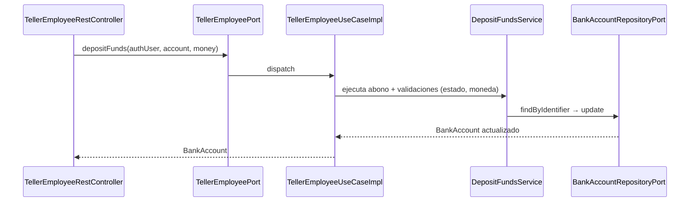

# Capa — Adapters de casos de uso

Paquete: `application/adapters/useCases/`. Implementan los 8 puertos de
entrada (`domain/ports/in/*Port`) inyectando **servicios de dominio
concretos**. No deciden reglas: orquestan y delegan.

## Matriz puerto → implementación

| Puerto `in` | `UseCaseImpl` | Servicios de dominio que inyecta |
|---|---|---|
| `PublicAccessPort` | `PublicAccessUseCaseImpl` | autenticación/registro de usuario y cliente |
| `NaturalCustomerPort` | `NaturalCustomerUseCaseImpl` | customer, account, loan, transfer, operation |
| `BusinessCustomerPort` | `BusinessCustomerUseCaseImpl` | customer, account, loan, transfer, usuario |
| `BusinessOperatorPort` | `BusinessOperatorUseCaseImpl` | account, transfer, operation |
| `BusinessSupervisorPort` | `BusinessSupervisorUseCaseImpl` | transfer, operation |
| `TellerEmployeePort` | `TellerEmployeeUseCaseImpl` | customer, account |
| `CommercialEmployeePort` | `CommercialEmployeeUseCaseImpl` | customer, loan, account |
| `InternalAnalystPort` | `InternalAnalystUseCaseImpl` | usuario, customer, loan, operation/auditoría |

Contrato en `SDD/Adapters/Use-cases-adapters.md`.

## Secuencia — `POST /teller/accounts/{n}/deposits` (delega a dominio)

## Comportamiento por endpoint

Cada método del `UseCaseImpl` hace exactamente una cosa: traducir la llamada
del controller a una o varias llamadas a servicios de dominio en el orden que
exige el caso de uso (p. ej. operador: `createCompanyTransfer` y, según el
umbral de `BusinessConfigurationPort`, `submitTransferForApproval`; natural:
`createTransfer` + `executeTransfer` atómicos). El detalle método por método
está en `11-endpoints-flujos.md`.
