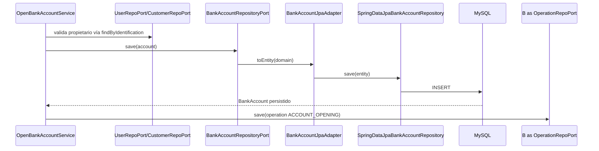

# Capa — Adapters de persistencia

Paquetes: `application/adapters/persistence/jpa/` (MySQL) y
`application/adapters/persistence/mongodb/` (auditoría). Implementan los
puertos `out` de repositorios. Cada agregado sigue el trío
**adapter → mapper bidireccional → entity/document + repositorio Spring Data**.

## JPA — MySQL (6 agregados)

| Adapter | Entity | Mapper | Spring Data repository |
|---|---|---|---|
| `UserJpaAdapter` | `UserJpaEntity` | `UserJpaMapper` | `SpringDataJpaUserRepository` |
| `CustomerJpaAdapter` | `CustomerJpaEntity` | `CustomerJpaMapper` | `SpringDataJpaCustomerRepository` |
| `BankAccountJpaAdapter` | `BankAccountJpaEntity` | `BankAccountJpaMapper` | `SpringDataJpaBankAccountRepository` |
| `LoanJpaAdapter` | `LoanJpaEntity` | `LoanJpaMapper` | `SpringDataJpaLoanRepository` |
| `TransferJpaAdapter` | `TransferJpaEntity` | `TransferJpaMapper` | `SpringDataJpaTransferRepository` |
| `OperationJpaAdapter` | `OperationJpaEntity` | `OperationJpaMapper` | `SpringDataJpaOperationRepository` |

La asociación `User.customer` se guarda como identificador de referencia y el
adapter la resuelve al leer. Contratos en `SDD/Adapters/Persistence-adapters.md`.

## MongoDB — auditoría (1 agregado)

`AuditLogMongoAdapter` → `AuditLogMongoMapper` ⇄ `AuditLogDocument`
(`audit_db.audit_logs`) vía `AuditLogMongoRepository`. El usuario ejecutor y
el producto afectado se guardan desnormalizados (id + atributos de
visualización) para leer auditoría sin cargar otros agregados. Único lector
HTTP: `GET /api/v1/internal-analyst/audit-logs` (con filtros en memoria
`userId`/`operationType` y paginación `page`/`size` en el controller).

## Secuencia — escritura (`POST /teller/accounts` → MySQL + auditoría)



## Secuencia — lectura de auditoría (`GET /internal-analyst/audit-logs`)

```mermaid
sequenceDiagram
    participant C as InternalAnalystRestController
    participant P as InternalAnalystPort
    participant S as ConsultAuditLogsService
    participant A as AuditLogMongoAdapter
    participant MO as MongoDB
    C->>P: consultAuditLog(authUser)
    P->>S: ejecuta (autoriza rol analista)
    S->>A: findAll / filtros
    A->>MO: find audit_logs
    MO-->>C: List&lt;AuditLog&gt; → filtros userId/operationType → página → AuditLogPageResponseDTO
```
