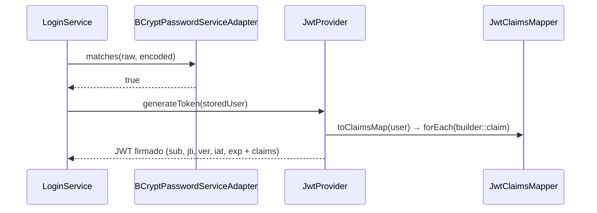

# Capa — Adapter de seguridad

Paquete: `application/adapters/security/` (+ `dtos/`, `mappers/`).
Concentra todo lo que el dominio necesita de seguridad detrás de puertos
`out` (`JwtServicePort`, `PasswordServicePort`) más el glue Spring
(`JwtAuthenticationFilter`, `SecurityConfig`, `BankUserDetailsAdapter`).

## Piezas

| Clase | Rol |
|---|---|
| `JwtProvider` | Implementa `JwtServicePort`: `generateToken`, `validateToken`, `getClaims`, `extractUserId/extractTokenVersion`, `reconstructUser`. Solo firma/parsea; el mapeo vive en el mapper |
| `dtos/JwtClaimsDTO` | Snapshot firmable de `User` + `Customer` (`ver`, `username`, `status`, `role`, PII, `custType`, `cust*`, `custBirthDate`, `custLegalRepIdentification`) |
| `mappers/JwtClaimsMapper` | `User ↔ JwtClaimsDTO ↔ Map<claims> ↔ Claims`; `applyClaims`, `toDomain`, `extractUserId/extractTokenVersion`, `parseUserStatus/parseCustomerStatus` |
| `dtos/AuthenticatedUserPrincipal` | DTO principal Spring (`UserDetails`) que envuelve el `User` de dominio; `ROLE_<code>`, bloqueo/activo desde `UserStatus` |
| `BankUserDetailsAdapter` | `UserDetailsService`: `sub String → Integer`, delega a `LoadAuthenticatedUserService`, envuelve en el principal, traduce dominio → `UsernameNotFoundException` |
| `BCryptPasswordServiceAdapter` | Implementa `PasswordServicePort` con `PasswordEncoder` (`matches`, `encrypt`) |
| `JwtAuthenticationFilter` | `OncePerRequestFilter`: extrae `Bearer`, valida, reconstruye `User`, rechaza inactivo/bloqueado o `ver` obsoleto, fija `Authentication` |
| `SecurityConfig` | `hasRole` por prefijo (`/auth/**` y `/actuator/**` públicos; cada rol su prefijo), stateless, `anonymous` deshabilitado, CORS por `FRONTEND_ORIGIN`, `PasswordEncoder` BCrypt |

Decisión académica documentada en código: el JWT embebe el snapshot de
usuario/cliente para autenticar sin round trip a BD; `ver` +
`User.authTokenVersion` invalidan tokens viejos (logout, cambio de estado o
contraseña). El filtro solo confía en la firma y en `ver`/estado del propio
token.

## Secuencia — `POST /auth/login` (emisión)



## Secuencia — petición protegida (validación por endpoint)

```mermaid
sequenceDiagram
    participant SPA as SPA
    participant F as JwtAuthenticationFilter
    participant J as JwtProvider
    participant M as JwtClaimsMapper
    participant C as Controller
    SPA->>F: Authorization: Bearer &lt;jwt&gt;
    F->>J: validateToken(token)
    J-->>F: true
    F->>J: reconstructUser(token)
    J->>M: toDomain(getClaims(token))
    M-->>F: User (+ Customer si custType)
    F->>F: isUsable? status ACTIVE y ver == tokenVersion
    F->>C: SecurityContext(AuthenticatedUserPrincipal)
```

## §5. Config y notificación (adaptadores afines)

- `adapters/config/DefaultBusinessConfigurationAdapter` implementa
  `BusinessConfigurationPort` (`transferApprovalThreshold`,
  `transferApprovalExpirationMinutes` desde `business.transfer.*`).
  Lo usa el flujo operador (`202 WAITING_FOR_APPROVAL` sobre el umbral).
- `adapters/notification/NoOpNotificationAdapter` implementa
  `NotificationPort` como no-op (punto de extensión para email/SMS).
