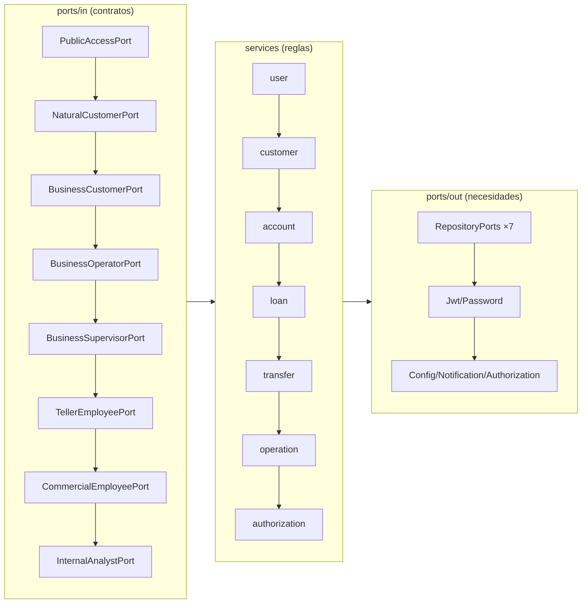

# Capa — Dominio

Paquete: `application/domain/`. Núcleo puro: **cero dependencias** a Spring,
JPA, Mongo, HTTP o JSON. Todo lo externo entra por puertos `out` que el
dominio posee como interfaces.

## Modelos (`models/`)

`User` (con `authTokenVersion` + `bumpAuthTokenVersion`), `Person`,
`Customer` → `NaturalCustomer` (con `birthDate`) / `BusinessCustomer` (con
`legalRepresentative`), `BankAccount`, `Loan`, `Transfer`, `Operation`,
`AuditLog`, `BankingProduct`, `AuthenticationResult`, `CustomerProducts`.
Los modelos concentran invariantes (p. ej. `Transfer.assignInitialStatus`,
`markWaitingForApproval`, `markExecuted`; `Loan.submitForReview`, `approve`,
`disburse`; `BankAccount.open/deposit/withdraw`).

## Value objects, enums, excepciones

- `valueobjects/`: `SystemRole` (7 roles + códigos `ROLE_*`),
  `UserStatus`, `CustomerStatus`, `AccountType`, `AccountStatus`,
  `Currency` (+ `Money`), `LoanType`, `LoanStatus`, `TransferStatus`,
  `OperationType`, `DomainCatalog`.
- `enums/`: `ApprovalDecision`, `AuditSeverity`, `NotificationChannel`.
- `exceptions/`: `DomainException` ← `EntityNotFoundException`,
  `InvalidCredentialsException`, `InsufficientBalanceException`,
  `CurrencyMismatchException`, `UnauthorizedOperationException`,
  `UnauthorizedCustomerOperationException`, `CustomerNotFound/AlreadyExists/NotEligible`,
  `Invalid*` por agregado y transición ilegal. El adapter REST los traduce a
  `400/401/403/404/409` (ver `05`).

## Servicios (`services/`) por agregado

| Grupo | Servicios (flujo de endpoints) |
|---|---|
| `user` | `LoginService` (username→password→estado→JWT), `LogoutService` (bump `ver`), `LoadAuthenticatedUserService` (`loadById`), `ConsultUserService`, `RegisterCustomerUserService`, `RegisterEmployeeUserService`, `ChangeUserStatusService`, `ChangeUserPasswordService` |
| `customer` | `RegisterNatural/BusinessCustomerService`, `UpdateCustomerService`, `ChangeCustomerStatusService`, `ConsultCustomerService`, `ConsultCustomerProductsService` |
| `account` | `OpenBankAccountService`, `ConsultBankAccountService`, `ConsultAccountBalanceService`, `DepositFundsService`, `WithdrawFundsService`, `Block/Unblock/CloseBankAccountService` |
| `loan` | `RequestLoanService`, `EvaluateLoanService`, `ValidateLoanEligibilityService`, `Approve/Reject/Disburse/CancelLoanService`, `RegisterLoanPaymentService`, `ConsultLoan/LoanStatusService` |
| `transfer` | `CreateTransferService`, `Approve/Reject/Execute/ExpireTransferService`, `ConsultTransferService` |
| `operation` | `RegisterOperationService`, `RegisterAuditLogService`, `RegisterOperationAndAuditService`, `ConsultOperations/AuditLogsService` |
| `authorization` | `Authorize*` + `Validate*` (rol, propiedad, estado operativo, umbrales, aprobadores) |

## Puertos

- `ports/in` (8, lo que el sistema **puede hacer**):
  `PublicAccessPort`, `NaturalCustomerPort`, `BusinessCustomerPort`,
  `BusinessOperatorPort`, `BusinessSupervisorPort`, `TellerEmployeePort`,
  `CommercialEmployeePort`, `InternalAnalystPort`.
- `ports/out` (lo que el dominio **necesita**):
  `User/Customer/BankAccount/Loan/Transfer/Operation/AuditLogRepositoryPort`,
  `JwtServicePort`, `PasswordServicePort`, `BusinessConfigurationPort`,
  `NotificationPort`, `AuthorizationPort`.

