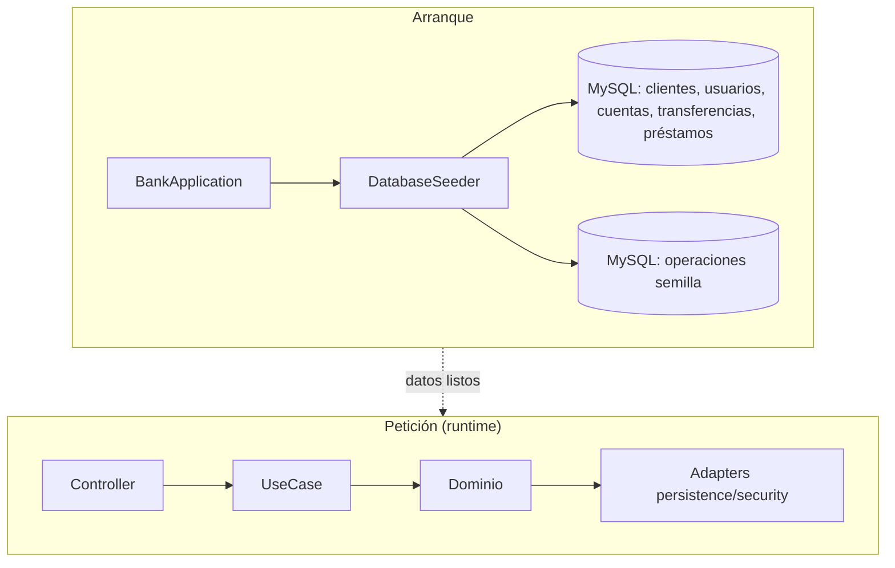

# Capa — Infraestructura

Paquete: `application/infrastructure/`. Solo bootstrap y configuración que
no es un adaptador de puerto. **No contiene lógica de negocio.** Tras la
reorganización de seguridad, la infraestructura queda mínima a propósito.

## Contenido actual

| Elemento | Rol en los flujos |
|---|---|
| `seed/DatabaseSeeder` (`CommandLineRunner`, `@Order(1)`) | Siembra idempotente para que todos los endpoints funcionen al arrancar: naturales Oliver/Aria, empresa + usuarios delegados, empleados, 7 cuentas, 9 transferencias (`EXECUTED`/`PENDING`/`WAITING_FOR_APPROVAL`), 3 préstamos (`UNDER_REVIEW`/`APPROVED`/`DISBURSED`). Clave única `Password123*` (vía `PasswordServicePort`). Registra operaciones semilla; si algo falla, loguea y la app continúa |
| `adapters/config/DefaultBusinessConfigurationAdapter` | Vive en `adapters/` (ver `08 §5`): lee `business.transfer.approval-threshold` y `approval-expiration-minutes` |
| `adapters/notification/NoOpNotificationAdapter` | Vive en `adapters/` (ver `08 §5`): no-op de `NotificationPort` |

## Nota de migración (por qué `security/` ya no está aquí)

`JwtProvider`, `BCryptPasswordServiceAdapter`, `JwtAuthenticationFilter`,
`SecurityConfig`, `BankUserDetailsAdapter` y `AuthenticatedUserPrincipal`
eran glue en `infrastructure/security/` y ahora son el **adaptador de
seguridad** en `application/adapters/security/` (ver `08`). La
infraestructura no guarda ningún DTO ni mapper de seguridad.

