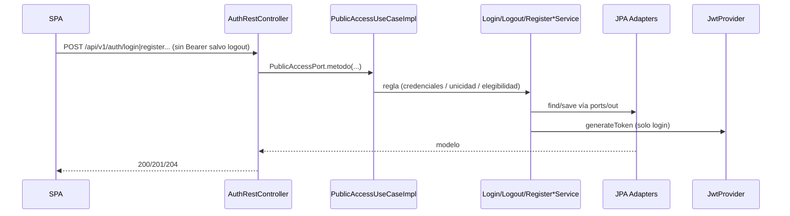
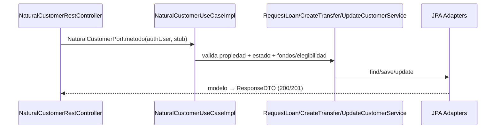
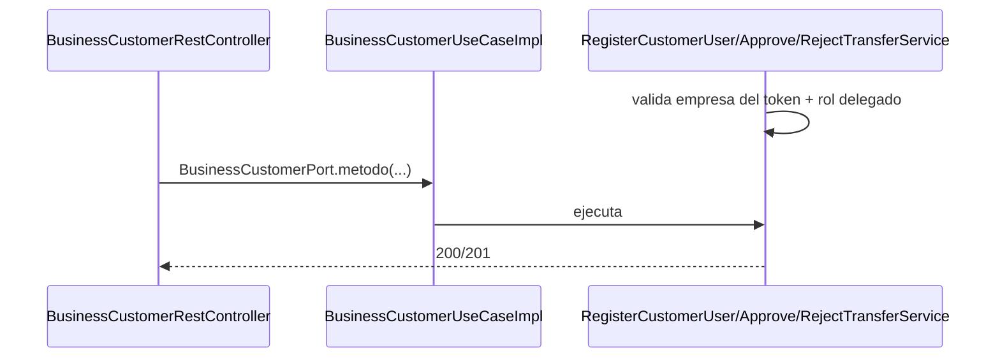
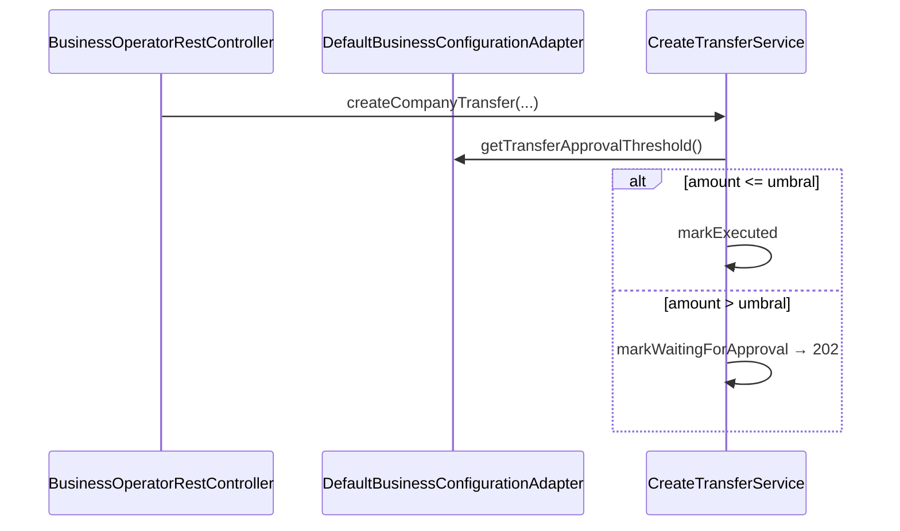
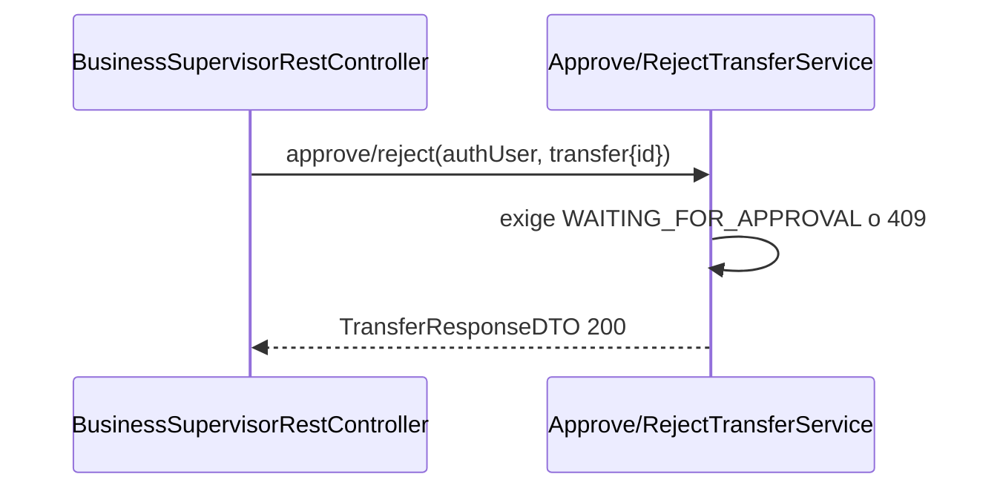
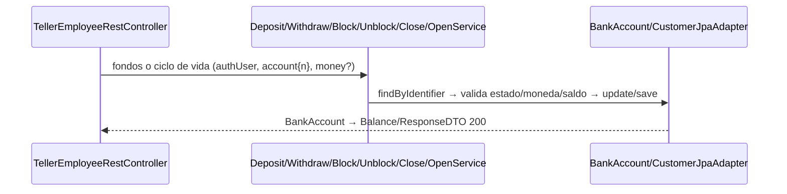
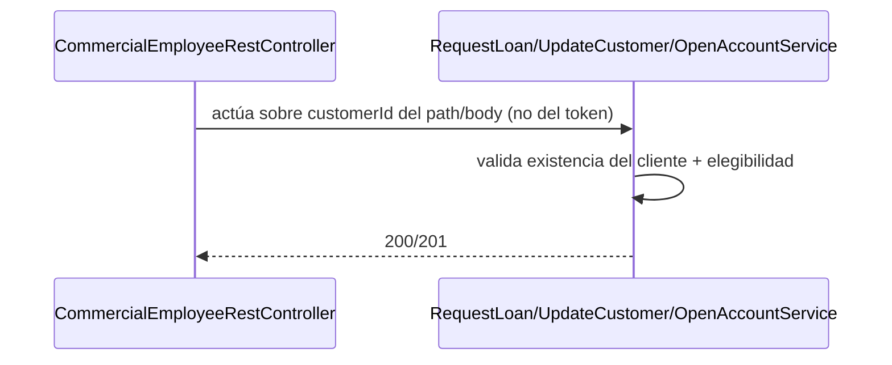
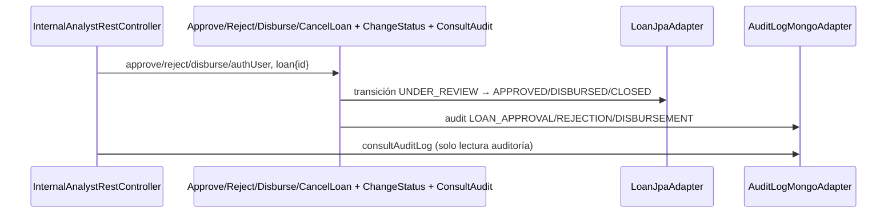

# Flujos por endpoint (todos los niveles)

Matriz verificada contra `adapters/rest/controllers/*.java`. Para cada
endpoint: transporte (L2) → componentes (L3) → clases (L4) → comportamiento.
Los diagramas de secuencia muestran el camino feliz; los errores van en la
tabla final.

## 1. Acceso público — `AuthRestController` (`PublicAccessPort`)

| Método | Path | Puerto `in` → Servicio | Puertos `out` | DTOs | OK |
|---|---|---|---|---|---|
| `POST` | `/api/v1/auth/login` | `login` → `LoginService` | `UserRepositoryPort`, `PasswordServicePort`, `JwtServicePort` | `LoginRequestDTO` → `LoginResponseDTO` | `200` + JWT |
| `POST` | `/api/v1/auth/logout` | `logout` → `LogoutService` | `UserRepositoryPort` (bump `ver`) | — | `204` |
| `POST` | `/api/v1/auth/register/natural-customer` | `registerNaturalCustomer` → `RegisterNaturalCustomerService` | `CustomerRepositoryPort`, `OperationRepositoryPort` | `RegisterNaturalCustomerRequestDTO` → `CustomerResponseDTO` | `201` |
| `POST` | `/api/v1/auth/register/business-customer` | `registerBusinessCustomer` → `RegisterBusinessCustomerService` | `CustomerRepositoryPort`, `OperationRepositoryPort` | `RegisterBusinessCustomerRequestDTO` → `BusinessCustomerResponseDTO` | `201` |
| `POST` | `/api/v1/auth/register/user` | `registerCustomerUser` → `RegisterCustomerUserService` | `Customer/UserRepositoryPort`, `PasswordServicePort` | `RegisterUserRequestDTO` → `UserResponseDTO` | `201` |

## 2. Cliente natural — `NaturalCustomerRestController` (`NaturalCustomerPort`, `ROLE_NATURAL_CUSTOMER`)

| Método | Path | Servicio | Notas |
|---|---|---|---|
| `GET` | `/natural-customer/profile` | `ConsultCustomerService` | Lee cliente del `User` del token |
| `PUT` | `/natural-customer/profile` | `UpdateCustomerService` | Exige `customer.identification` en el token (`401` si falta) |
| `GET` | `/natural-customer/accounts` | `ConsultBankAccountService` | Lista por propietario |
| `GET` | `/natural-customer/products` | `ConsultCustomerProductsService` | Agregado cuentas+préstamos |
| `GET` | `/natural-customer/accounts/{n}/balance` | `ConsultAccountBalanceService` | `Money` → `AccountBalanceResponseDTO` |
| `POST` | `/natural-customer/loans` (alias `/loan`) | `RequestLoanService` | `201 UNDER_REVIEW`, loguea alias singular |
| `GET` | `/natural-customer/loans/{id}` (alias `/loan/{id}`) | `ConsultLoanService` | |
| `POST` | `/natural-customer/loans/{id}/payments` (alias `/loan/...`) | `RegisterLoanPaymentService` | `Money.of(amount, COP)`, responde `LoanPaymentResponseDTO` |
| `POST` | `/natural-customer/transfers` | `CreateTransferService` + ejecución atómica | `201 EXECUTED`; si falla, nada queda como ejecutado |
| `GET` | `/natural-customer/operations` | `ConsultOperationsService` | Historial propio |

## 3. Cliente empresarial — `BusinessCustomerRestController` (`BusinessCustomerPort`, `ROLE_BUSINESS_CUSTOMER`)

| Método | Path | Servicio |
|---|---|---|
| `GET` | `/business-customer/profile` | `ConsultCustomerService` |
| `GET` | `/business-customer/products` | `ConsultCustomerProductsService` |
| `GET` | `/business-customer/accounts` | `ConsultBankAccountService` |
| `POST` | `/business-customer/loans` | `RequestLoanService` (solicitante = empresa del token) |
| `POST` | `/business-customer/users` | `RegisterCustomerUserService` (`RegisterCompanyUserRequestDTO`, roles operador/supervisor) |
| `PATCH` | `/business-customer/transfers/{id}/approve` | `ApproveTransferService` |
| `PATCH` | `/business-customer/transfers/{id}/reject` | `RejectTransferService` (`RejectTransferRequestDTO`) |

## 4. Operador — `BusinessOperatorRestController` (`BusinessOperatorPort`, `ROLE_BUSINESS_OPERATOR`)

| Método | Path | Comportamiento |
|---|---|---|
| `POST` | `/business-operator/transfers` | `createCompanyTransfer` + umbral `BusinessConfigurationPort`: bajo umbral ejecuta, sobre umbral persiste `WAITING_FOR_APPROVAL` → `202` |
| `POST` | `/business-operator/transfers/{id}/submit` | `submitTransferForApproval` (reenvía a aprobación) |
| `GET` | `/business-operator/accounts` | Cuentas de la empresa |
| `GET` | `/business-operator/operations` | Operaciones de la empresa |

## 5. Supervisor — `BusinessSupervisorRestController` (`BusinessSupervisorPort`, `ROLE_BUSINESS_SUPERVISOR`)

| Método | Path | Comportamiento |
|---|---|---|
| `GET` | `/business-supervisor/transfers/pending` | Lista `WAITING_FOR_APPROVAL` |
| `PATCH` | `/business-supervisor/transfers/{id}/approve` | `ApproveTransferService` (+ `ApproveTransferRequestDTO` según SDD) |
| `PATCH` | `/business-supervisor/transfers/{id}/reject` | `RejectTransferService` (`404` si no existe, `409` si no está pendiente) |
| `GET` | `/business-supervisor/operations` | Operaciones de la empresa |

## 6. Cajero — `TellerEmployeeRestController` (`TellerEmployeePort`, `ROLE_TELLER_EMPLOYEE`)

| Método | Path | Servicio | Notas |
|---|---|---|---|
| `GET` | `/teller/customers/{identification}` | `ConsultCustomerService` | `400` sin identification, `404 CUSTOMER_NOT_FOUND` |
| `POST` | `/teller/accounts` | `OpenBankAccountService` | `BankAccountRequestDTO` interna (`SAVINGS\|CHECKING\|BUSINESS`, `COP\|USD\|EUR`); responde `200` (código actual) |
| `GET` | `/teller/accounts/{n}` | `ConsultBankAccountService` | `404` cuenta desconocida |
| `GET` | `/teller/accounts/{n}/balance` | `ConsultAccountBalanceService` | `404` cuenta desconocida |
| `POST` | `/teller/accounts/{n}/deposits` | `DepositFundsService` | `DepositRequestDTO`, loguea cajero |
| `POST` | `/teller/accounts/{n}/withdrawals` | `WithdrawFundsService` | `WithdrawalRequestDTO` + `clientIdentification` |
| `PATCH` | `/teller/accounts/{n}/block` | `BlockBankAccountService` | `BlockAccountRequestDTO` |
| `PATCH` | `/teller/accounts/{n}/unblock` | `UnblockBankAccountService` | `409` si no bloqueada/transición ilegal |
| `PATCH` | `/teller/accounts/{n}/close` | `CloseBankAccountService` | `409` si saldo ≠ 0 / transición ilegal |

## 7. Comercial — `CommercialEmployeeRestController` (`CommercialEmployeePort`, `ROLE_COMMERCIAL_EMPLOYEE`)

| Método | Path | Servicio |
|---|---|---|
| `POST` | `/commercial/loans` | `RequestLoanService` (`CommercialRequestLoanRequestDTO` con `customerIdentification`) → `201` |
| `GET` | `/commercial/customers/{id}` | `ConsultCustomerService` |
| `PUT` | `/commercial/customers/{id}` | `UpdateCustomerService` (`UpdateCustomerProfileRequestDTO`) |
| `GET` | `/commercial/customers/{id}/products` | `ConsultCustomerProductsService` |
| `GET` | `/commercial/loans/{id}` | `ConsultLoanStatusService` |
| `POST` | `/commercial/accounts` | `OpenBankAccountService` → `201` |

## 8. Analista — `InternalAnalystRestController` (`InternalAnalystPort`, `ROLE_INTERNAL_ANALYST`)

| Método | Path | Servicio | Notas |
|---|---|---|---|
| `POST` | `/internal-analyst/users/employee` | `RegisterEmployeeUserService` | `201` |
| `PATCH` | `/internal-analyst/customers/{id}/status` | `ChangeCustomerStatusService` | `ChangeCustomerStatusRequestDTO` |
| `PATCH` | `/internal-analyst/loans/{id}/approve` | `ApproveLoanService` | `ApproveLoanRequestDTO` |
| `PATCH` | `/internal-analyst/loans/{id}/reject` | `RejectLoanService` | `404`/`409` |
| `POST` | `/internal-analyst/loans/{id}/disburse` | `DisburseLoanService` | |
| `DELETE` | `/internal-analyst/loans/{id}` | `CancelLoanService` (close) | `204`; el SDD describe `PATCH /close`, el código expone `DELETE` |
| `GET` | `/internal-analyst/audit-logs?userId&operationType&page&size` | `ConsultAuditLogsService` | MongoDB, filtros + paginación en controller → `AuditLogPageResponseDTO` |
| `GET` | `/internal-analyst/operations` | `ConsultOperationsService` | |
| `PATCH` | SDD `/internal-analyst/users/{id}/status` | `ChangeUserStatusService` | Especificado en SDD (sin homomorphism 1:1 actual en controller) |

## 9. Errores por endpoint (global)

| Caso | HTTP | Origen |
|---|---|---|
| Body inválido (`@Valid`) | `400` | `GlobalExceptionHandler` / validación |
| Credenciales inválidas (login) | `401` | `InvalidCredentialsException` |
| Sin `Bearer` / firma inválida / expirado | `403` | `JwtAuthenticationFilter` + `SecurityConfig` |
| Token con `ver` obsoleto (post-logout) o rol distinto al prefijo | `403` | filtro / `hasRole` |
| No existe (usuario, cliente, cuenta, préstamo, transferencia) | `404` + envelope | `EntityNotFoundException` |
| Transición ilegal, saldo insuficiente, moneda distinta, duplicado | `409` | excepciones de dominio |
| Logout | `204` sin cuerpo | `LogoutService` (bump `ver`) |

Contratos finos de DTOs y validaciones: `SDD/Adapters/Api-rest-endpoints.md`,
`Rest-validation.md`, `Global-exception-handler.md`, `Rest-security-cors.md`.
