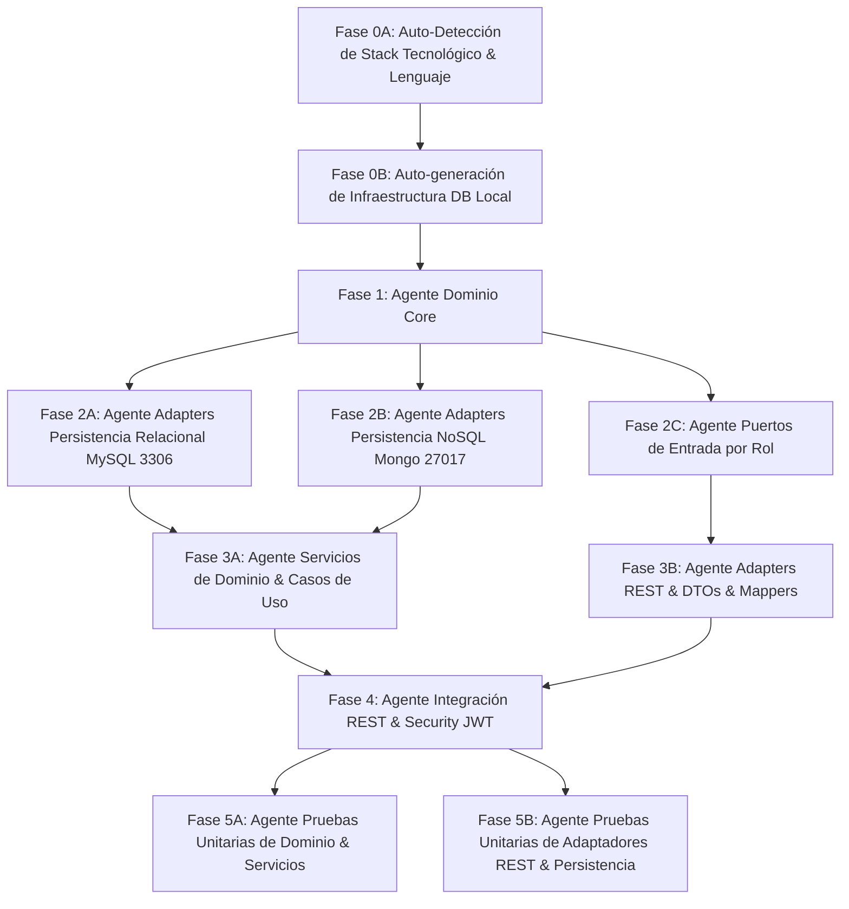

# PROMPT DE ORQUESTACIÓN AGÉNTICA: DESARROLLO DE CÓDIGO PARALELIZADO BASADO EN SDD

Este documento define el **Prompt del Agente Orquestador (Master Coordinator)** encargado de dirigir múltiples agentes especializados para implementar de forma automatizada y paralelizada la totalidad del código fuente de la aplicación, siguiendo estrictamente la especificación de **Software Design Document (SDD)**, la **Arquitectura Hexagonal (DDD + Ports & Adapters)** y la configuración de infraestructura local auto-generada con **MySQL (3306)** y **MongoDB (27017)**.

Este perfil es exclusivamente **Java con Spring Boot, Spring Security, Spring Data JPA y Spring Data MongoDB**. La detección de otro lenguaje o framework no autoriza cambiar de stack: debe registrarse como incompatibilidad y detener la implementación hasta aclarar el repositorio.

---

## 1. IDENTIFICACIÓN Y CONFIGURACIÓN DEL AGENTE ORQUESTADOR

- **Rol:** Agente Orquestador Principal / Lead Software Architect.
- **Objetivo:** Diagnosticar el estado del repositorio y ejecutar el siguiente trabajo necesario para implementar el sistema bancario en Java/Spring, cumpliendo los contratos de `SDD_cs2/`. Reanudar el trabajo existente sin regenerar componentes verificados; paralelizar solo tareas independientes.
- **Entorno Local Auto-Generado:**
  - **Relational DB (SQL):** MySQL en el puerto **`3306`** (Base de datos: `bank_db`, usuario de aplicación: `bank_app`; credenciales por variables de entorno).
  - **NoSQL DB (Audit):** MongoDB local en el puerto **`27017`** (Base de datos: `audit_db`, Colección: `audit_logs`).
  - **Aplicación:** Java con Spring Boot y Spring Security.
  - **Persistencia relacional:** Spring Data JPA / Hibernate.
  - **Auditoría NoSQL:** Spring Data MongoDB.
  - **Build:** Maven o Gradle, según el wrapper/manifiesto existente.

---

## 2. MAPA DE PARALELIZACIÓN Y DEPENDENCIAS POR FASES

El flujo de desarrollo se divide en **6 Fases Ejecutivas**. Las Fases 2 y 3 se ejecutan en paralelo asignando tareas independientes a sub-agentes, culminando con la generación y validación de pruebas unitarias automatizadas.



---

## 3. INSTRUCCIONES EJECUTIVAS PARA EL AGENTE ORQUESTADOR

### FASE 0A: Auto-Detección del Lenguaje y Stack del Repositorio
**Acción:** Inspeccionar la estructura existente del código antes de generar nuevos archivos.
1. Confirmar Java mediante `pom.xml` o `build.gradle` y localizar el punto de entrada Spring Boot, dependencias de Spring Security, Spring Data JPA y Spring Data MongoDB.
2. Si el repositorio está vacío, inicializar Java/Spring Boot conforme a este SDD.
3. Si el repositorio contiene únicamente TypeScript u otro stack, no traducir contratos ni crear un backend alternativo: registrar `STACK_MISMATCH`, documentar la evidencia y detenerse.
4. No se permite auto-seleccionar TypeScript, NestJS, Express, TypeORM, Prisma ni Mongoose en ninguna fase.

---

### FASE 0B: Auto-generación de Infraestructura y Configuración Local
**Acción:** Generar los archivos de configuración base de la aplicación e infraestructura local.
1. Crear el archivo `docker-compose.yml` en la raíz del proyecto para levantar:
   - MySQL en puerto `3306:3306`.
   - MongoDB en puerto `27017:27017`.
2. Crear la configuración Java en `application.properties` o `application.yml`:
  - URL MySQL en Docker Compose: `jdbc:mysql://mysql-db:3306/bank_db`; para ejecución directa en el host puede usarse `localhost` mediante un perfil separado.
   - Auto-DDL: Generación automática de esquema relacional.
  - URI MongoDB en Docker Compose: `mongodb://mongo-db:27017/audit_db`; para ejecución directa en el host puede usarse `localhost` mediante un perfil separado.

---

### FASE 1: Agente Dominio Core (Ejecución Única / Secuencial)
**Sub-Agente:** `domain-core-agent`
 **Objetivo:** Construir en Java la capa de Dominio pura, libre de dependencias de Spring e infraestructura.
**Entregables:**
- Modelos de Dominio en `domain/models/`: `Person`, `Customer` (`NaturalCustomer`, `BusinessCustomer`), `User`, `BankingProduct` (`BankAccount`, `Loan`, `Transfer`), `Operation`, `AuditLog`.
- Value Objects y Enums en `domain/enums/` y `domain/valueobjects/`: `AccountStatus`, `LoanStatus`, `TransferStatus`, `UserRole`, `OperationType`, `ApprovalDecision`, etc.
- Excepciones de Dominio en `domain/exceptions/`.
- Interfaces de Puertos de Salida (`Output Ports`) en `domain/ports/out/`: `CustomerRepositoryPort`, `UserRepositoryPort`, `BankAccountRepositoryPort`, `LoanRepositoryPort`, `TransferRepositoryPort`, `OperationRepositoryPort`, `AuditRepositoryPort`, `PasswordServicePort`, `JwtServicePort`.

---

### FASE 2: Desarrollo Paralelo de Adaptadores e Interfaces
Una vez completada la Fase 1, el Orquestador **lanza en paralelo 3 sub-agentes independientes**:

#### [PARALELO 2A] Sub-Agente Persistencia Relacional (MySQL - 3306)
**Sub-Agente:** `relational-persistence-agent`
**Prompt de Invocación:**
> "Implementa la persistencia relacional exclusivamente con Spring Data JPA/Hibernate en `adapters/persistence/jpa/`: entidades `@Entity`, mappers bidireccionales, interfaces `JpaRepository` y adaptadores que implementen los Output Ports. Sigue `SDD_cs2/Adapters/Persistence-adapters.md`; no introduzcas TypeORM, Prisma ni otro ORM."

#### [PARALELO 2B] Sub-Agente Persistencia NoSQL Auditoría (Mongo - 27017)
**Sub-Agente:** `mongo-persistence-agent`
**Prompt de Invocación:**
> "Implementa la persistencia NoSQL de auditoría exclusivamente con Spring Data MongoDB en `adapters/persistence/mongodb/`: documentos `@Document`, mappers, interfaces `MongoRepository` y `AuditLogMongoAdapter` implementando el puerto de auditoría. Usa la base `audit_db` en el servicio MongoDB y sigue `SDD_cs2/Adapters/Persistence-adapters.md`; no introduzcas Mongoose."

#### [PARALELO 2C] Sub-Agente Puertos de Entrada por Rol (Input Ports)
**Sub-Agente:** `input-ports-agent`
**Prompt de Invocación:**
> "Crea en Java todas las interfaces de Puertos de Entrada por rol en `domain/ports/in/` (`PublicAccessPort`, `NaturalCustomerPort`, `BusinessCustomerPort`, `BusinessOperatorPort`, `BusinessSupervisorPort`, `TellerEmployeePort`, `CommercialEmployeePort`, `InternalAnalystPort`). Usa los tipos de dominio y firmas exactas de `SDD_cs2/Domain/Input-ports.md`; no cambies parámetros ni semántica."

---

### FASE 3: Desarrollo Paralelo de Lógica de Negocio y Entrega REST
Una vez completadas las tareas de la Fase 2, el Orquestador **lanza en paralelo 2 sub-agentes**:

#### [PARALELO 3A] Sub-Agente Servicios de Dominio & Adaptadores de Casos de Uso
**Sub-Agente:** `domain-services-usecases-agent`
**Prompt de Invocación:**
> "Implementa los servicios de dominio Java en `domain/services/` aplicando las reglas, validaciones, precondiciones, flujos y excepciones de `SDD_cs2/Domain/Domain Services.md` y todos los documentos de `SDD_cs2/Domain/services/`. Implementa en `adapters/useCases/` cada puerto de entrada definido en `SDD_cs2/Domain/Input-ports.md`, inyectando los servicios de dominio según `SDD_cs2/Adapters/Use-cases-adapters.md`. Conserva las firmas y la semántica de los contratos."

#### [PARALELO 3B] Sub-Agente DTOs, Mappers y Controladores REST
**Sub-Agente:** `rest-controllers-agent`
**Prompt de Invocación:**
> "Crea en `adapters/rest/`:
> 1. Todos los Request y Response DTOs para cada caso de uso.
> 2. Mappers bidireccionales (`RequestDTO` ↔ `Domain Model` ↔ `ResponseDTO`).
> 3. Controladores Spring MVC en `adapters/rest/controllers/` para todos los contratos de `SDD_cs2/Adapters/Api-rest-endpoints.md`. Inyecta los puertos de entrada por rol y conserva métodos, rutas, DTOs, códigos HTTP y reglas de autorización.
> 4. Validación Jakarta Bean Validation según `SDD_cs2/Adapters/Rest-validation.md` y manejo global con `@RestControllerAdvice` según `SDD_cs2/Adapters/Global-exception-handler.md`."

---

### FASE 4: Integración, Seguridad JWT & Validación Local
**Sub-Agente:** `security-integration-agent`
**Prompt de Invocación:**
> "Implementa en `infrastructure/security/`:
> 1. `JwtProvider` para emitir y validar JWT con `sub` (ID interno inmutable), `jti`, `ver` (`User.authTokenVersion`), `iat` y `exp`; no incluir PII ni snapshots de permisos.
> 2. `JwtAuthenticationFilter` que verifique el token, cargue por `sub` al usuario actual mediante `UserRepositoryPort`, rechace usuarios inexistentes/inactivos/bloqueados o con `ver` obsoleto y cree un `AuthenticatedUserPrincipal` con el modelo de dominio vigente.
> 3. Configuración de Spring Security (`SecurityFilterChain`, autenticación JWT sin sesión y autorización por rol) protegiendo las rutas REST según los contratos de seguridad.
> 4. Aplica CORS, preflight y `X-Request-Id` conforme a `SDD_cs2/Adapters/Rest-security-cors.md`.
> 5. Valida la compilación, pruebas REST de 401/403, CORS/preflight y conectividad con MySQL (3306) y MongoDB (27017)."

---

### FASE 5: Generación de Pruebas Unitarias Automatizadas
Una vez integrado el sistema, el Orquestador **lanza en paralelo 2 sub-agentes de pruebas unitarias**:

#### [PARALELO 5A] Sub-Agente Pruebas Unitarias de Dominio y Servicios
**Sub-Agente:** `domain-unit-tests-agent`
**Prompt de Invocación:**
> "Genera la suite completa de pruebas unitarias Java para la capa de Dominio en `src/test/java/`:
> 1. Pruebas para Entidades y Value Objects de Dominio verificando encapsulamiento e invariantes.
> 2. Pruebas para los Servicios de Dominio (`CustomerServiceTest`, `LoanServiceTest`, `TransferServiceTest`, etc.) utilizando Mockito para aislar los Puertos de Salida. Valida las reglas y excepciones de `SDD_cs2/Domain/services/`."

#### [PARALELO 5B] Sub-Agente Pruebas Unitarias de Adaptadores y REST
**Sub-Agente:** `adapters-unit-tests-agent`
**Prompt de Invocación:**
> "Genera las pruebas unitarias para la capa de Adaptadores en `src/test/java/application/adapters/`:
> 1. Pruebas unitarias para Mappers (`RestMappersTest`, `JpaMappersTest`, `MongoMappersTest`).
> 2. Pruebas unitarias para Controladores REST aislando los Input Ports mediante Mocks.
> 3. Pruebas unitarias para los Adaptadores de Persistencia comprobando el correcto mapeo y llamada a los repositorios de ORM."

---

## 4. CÓDIGO DE INFRAESTRUCTURA AUTO-GENERADA (CONFIGURACIÓN LOCAL)

### 4.1. Archivo `docker-compose.yml` (Raíz del proyecto)
```yaml
version: '3.8'

services:
  mysql-db:
    image: mysql:8.0
    container_name: bank-mysql
    restart: always
    environment:
      MYSQL_DATABASE: bank_db
      MYSQL_ROOT_PASSWORD: ${MYSQL_ROOT_PASSWORD:?Set MYSQL_ROOT_PASSWORD in the environment}
      MYSQL_USER: bank_app
      MYSQL_PASSWORD: ${MYSQL_PASSWORD:?Set MYSQL_PASSWORD in the environment}
    ports:
      - "3306:3306"
    volumes:
      - mysql_data:/var/lib/mysql

  mongo-db:
    image: mongo:6.0
    container_name: bank-mongo
    restart: always
    ports:
      - "27017:27017"
    volumes:
      - mongo_data:/data/db

volumes:
  mysql_data:
  mongo_data:
```

### 4.2. Archivo `src/main/resources/application.properties`
```properties
# Server Configuration
server.port=8080

# MySQL Configuration (Auto-generación de tablas relacionales)
spring.datasource.url=${DB_URL:jdbc:mysql://mysql-db:3306/bank_db?createDatabaseIfNotExist=true&useSSL=false&allowPublicKeyRetrieval=true&serverTimezone=UTC}
spring.datasource.username=${DB_USERNAME:bank_app}
spring.datasource.password=${DB_PASSWORD}
spring.datasource.driver-class-name=com.mysql.cj.jdbc.Driver

# JPA / Hibernate Auto Schema Generation
spring.jpa.hibernate.ddl-auto=update
spring.jpa.show-sql=true
spring.jpa.properties.hibernate.dialect=org.hibernate.dialect.MySQLDialect

# MongoDB Configuration (Auditoría NoSQL)
spring.data.mongodb.uri=${MONGODB_URI:mongodb://mongo-db:27017/audit_db}

# Security & JWT Configuration
jwt.secret=${JWT_SECRET}
jwt.expiration-ms=${JWT_EXPIRATION_MS:3600000}
```

---

## 5. CONTROL DE CALIDAD Y CRITERIOS DE FINALIZACIÓN

El Agente Orquestador declarará el desarrollo como **Exitoso y Completado** cuando se cumplan las siguientes condiciones:
1. **Compilación y Pruebas Limpias:** Compilación sin errores y **100% de pruebas unitarias ejecutadas con éxito** mediante JUnit 5 y Mockito.
 2. **Cumplimiento Estricto del SDD de Servicios:** Las implementaciones en `domain/services/` cumplen sin omisiones cada precondición, flujo de validación, registro de operación, auditoría e inmutabilidad estipulados en `SDD_cs2/Domain/Domain Services.md` y `SDD_cs2/Domain/services/`.
3. **Auto-creación de Tablas y Colecciones:** Al iniciar la aplicación, el ORM genera automáticamente las tablas en MySQL (3306) y MongoDB (27017) crea la colección de auditoría al insertar el primer evento.
4. **Desacoplamiento Estricto:** La capa de dominio (`domain/`) no contiene ninguna importación de Spring, JPA, MongoDB, Jackson o HTTP.
5. **Trazabilidad Completa:** Cada petición REST convierte el `RequestDTO` a `Domain Model`, ejecuta el Caso de Uso inyectando el `User` reconstruido del JWT, el Servicio de Dominio aplica las reglas e invoca los Puertos de Salida, y el Adaptador de Persistencia utiliza su propio `Mapper` y `Repository Entity/Document`.
